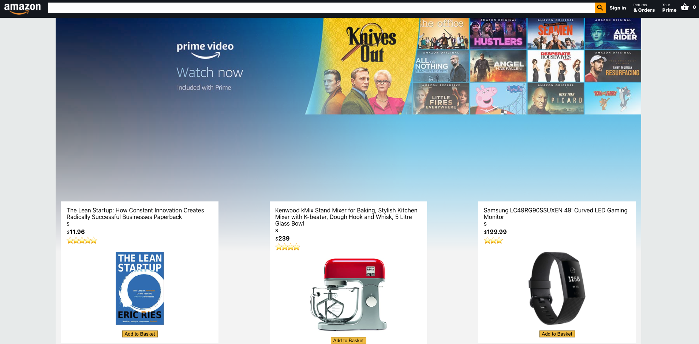

## Amazon Clone

A fully functional E-commerce website of clone of Amazon, allowing user login/authentication using Firebase.

## Tech/Framework:

1. React.js
2. Firebase/Firestore
3. Axios
4. React context API
5. Stripe

## Installations:
1. Add API keys - see Adding API Key dependencies
2. npm install
3. npm start
4. Head to http://localhost:3000 on the browser

## Adding API Key Dependencies:
This program requires the following API keys. These can be obtained here(folow the instructions of website links)
1. Stripe API(https://stripe.com/docs/payments/checkout)
2. Firebase account(https://firebase.google.com/docs)

## Features:

1. Firebase user authentication
2. Firebase database
3. Purchase items using Stripe/axios
4. React Context API
5. React Router
6. Add to cart notifications
7. Instant total of item

## Walkthrough

Please click to watch

